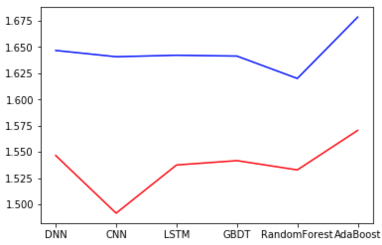

# StockPredicting
Stock midprice predicting using multiple methods

We first use the 108 indicator data to do regression and predict the value. The methods we used includes LSTM, CNN, Random Forest, AdaBoost and GBDT. What's more, we also tried out the raw data to do prediction. In the condition, we use 30 data points to predict the future 10th data and get the result MSE loss as follow.

The blue line is about indicator data, we did PCA to the indicator data to reform the 108-d vector into only 54-d. Later we will show the effect of PCA. The red line is using raw data and we can see AdaBoost may perform the worst and CNN, random forest get better result.

Next we want to find out the influence of using different sample gap and sequence length. That is, using 50 data points to predict 10th, or 100 data predicting 50th. The result using LSTM is as follow.

We can see the best one is using 50 data points to predict 10th data with sample gap 50. Also not shown in the graph, using 30 data points to predict 10th data is even better. Thus we use 10, 30, 30 as the N, sequence  length and sample gap from now on.

This graph shows the effect of PCA. PCA wipes out half of the data dimensions and makes it much faster. Though the performance down, it is acceptable for the little loss exchanging with faster speed.

Next we try to generate new features to get better performance. Linear transformation, wavelet transfomation, feature tools and the paper-mentioned method is used here.

We can see that wavelet transform gets the best result. Linear transformation is almost the same result with original data while feature tools did generates out some useful things.

Finally we use the method mentioned in the [paper](https://journals.plos.org/plosone/article?id=10.1371/journal.pone.0180944) where use wavelet transform, SAE & LSTM together to get a better performance. WT can wipe out the noises, SAE can give us some high dimensional features and finally LSTM predicts. The network structure is as follow.

